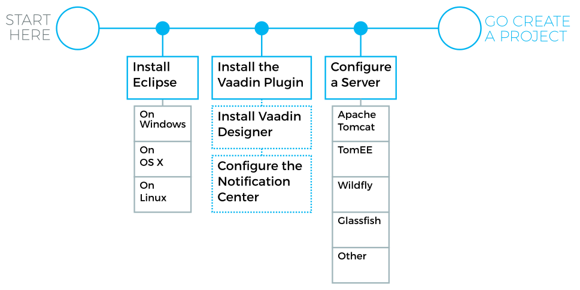
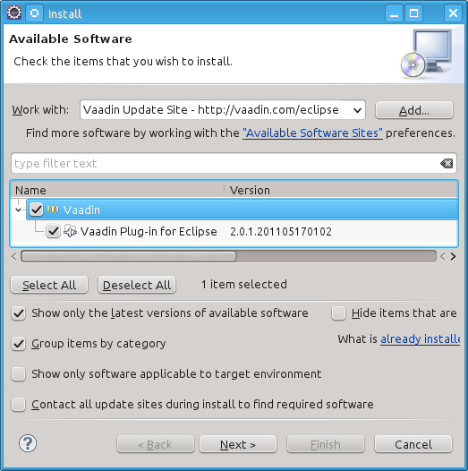
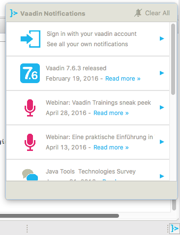
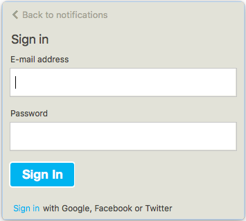
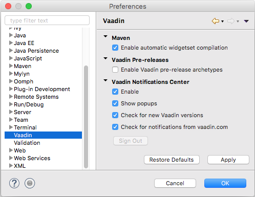

[[installing.eclipse]]
= Installing the Eclipse IDE and Plugin

If you are using the Eclipse IDE, using the Vaadin Plugin for Eclipse helps
greatly. The plugin includes wizards for creating new Vaadin-based projects,
themes, and client-side widgets and widget sets. Notice that you can also create
Vaadin projects as Maven projects in Eclipse.

Using Eclipse IDE for Vaadin development requires installing the IDE itself and the Vaadin Plugin for Eclipse.
You are adviced to also configure a web server in Eclipse.
You can then use the server for running the Vaadin applications that you create.

.Installation of the Eclipse IDE toolchain

Vaadin Designer is a visual design tool for professional developers.
It allows for easy creation of declarative designs.
It is also good as a sketching tool, as well as an easy way to learn about Vaadin components and layouts.

Once you have installed the Eclipse IDE and the plug-in, you can create a Vaadin application project as described in <<DUMMY/../../getting-started/getting-started-first-project#getting-started.first-project, "Creating a Project in Eclipse">>.

[[installing.eclipse.ide]]
== Installing the Eclipse IDE

=== Windows

. Download the Eclipse IDE for Java EE Developers from
link:http://www.eclipse.org/downloads/[http://www.eclipse.org/downloads/]

. Decompress the Eclipse IDE package to a suitable directory.
You are free to select any directory and to use any ZIP decompressor, but in this example we decompress the ZIP file by just double-clicking it and selecting "Extract all files" task from Windows compressed folder task.
In our installation example, we use [filename]#C:\dev# as the target directory.

Eclipse is now installed in [filename]#C:\dev\eclipse#.
You can start it from there by double clicking [filename]#eclipse.exe#.

=== Linux / OS X / UNIX

We recommend that you install Eclipse manually in Linux and other UNIX variants.
They may have it available from a package repository, but using such an installation may cause problems with installing plug-ins.

You can install Eclipse as follows:

. Download Eclipse IDE for Java EE Developers from
link:http://www.eclipse.org/downloads/[http://www.eclipse.org/downloads/]

. Decompress the Eclipse package into a suitable base directory.
It is important to make sure that there is no old Eclipse installation in the target directory.
Installing a new version on top of an old one probably renders Eclipse unusable.

. Eclipse should normally be installed as a regular user, which makes installation of plug-ins easier.
Eclipse also stores some user settings in the installation directory.
+
To install the package, enter:
+
[subs="normal"]
----
[prompt]#$# [command]#tar# zxf [replaceable]##<path>##/eclipse-jee-[replaceable]##<version>##.tar.gz
----
+
This will extract the package to a subdirectory with the name
[filename]#eclipse#.

. If you wish to enable starting Eclipse from command-line, you need to add the
Eclipse installation directory to your system or user PATH, or make a symbolic
link or script to point to the executable.

An alternative to the above procedure would be to use an Eclipse version
available through the package management system of your operating system. It is,
however, __not recommended__, because you will need write access to the Eclipse
installation directory to install Eclipse plugins, and you may face
incompatibility issues with Eclipse plugins installed by the package management
of the operating system.

[[installing.eclipse.plugin]]
== Installing the Vaadin Plugin

You can install the plugin as follows:

. Select "Help > Install New Software...".

. Add the Vaadin plugin update site by clicking [guibutton]#Add...# button.
+
image::img/plugin-install-addsite.png[]
+
Enter a name such as "Vaadin Update Site" and the URL of the update site:
http://vaadin.com/eclipse. If you want or need to use the latest unstable
plugin, which is usually more compatible with development and beta releases of
Vaadin, you can use http://vaadin.com/eclipse/experimental and give it a
distinctive name such as "Vaadin Experimental Site". Then click [guibutton]#OK#.
The Vaadin site should now appear in the [guilabel]#Available Software# window.

. Currently, if using the stable plugin, the [guilabel]#Group items by category# should be enabled. If using the experimental plugin, it should be disabled. This may change in future.

. Select all the Vaadin plugins in the tree.
+

+
Then, click [guibutton]#Next#.

. Review the installation details and click [guibutton]#Next#.

. Accept or unaccept the license. Finally, click [guibutton]#Finish#.

. After the plugin is installed, Eclipse will ask to restart itself. Click
[guibutton]#Restart#.

More installation instructions for the Eclipse plugin can be found at
http://vaadin.com/eclipse.

[[getting-started.eclipse.notification.overview]]
== Notification Center

The notification center is a feature of the Vaadin Eclipse plug-in. It displays
notifications about new Vaadin releases as well as news about upcoming events,
such as webinars. The notification center can be connected to your Vaadin
account.

The plug-in adds an indicator in the bottom right corner. The indicator shows
whether or not there are any pending notifications. The indicator turns red when there are new notifications.

Clicking the tray icon opens up the pop-up, as shown
in <<figure.getting-started.eclipse.notification-center.overview>>.

[[figure.getting-started.eclipse.notification-center.overview]]
.Overview of the notification center

By clicking a notification in the list, you can open it up.

.Detailed view of a notification

Clicking on the [guilabel]#Clear All# icon in the main pop-up clears all notifications and marks them all as read.

[[getting-started.eclipse.notification.signin]]
=== Signing in

The notification center uses your Vaadin account to determine
which notifications you have acknowledged as read. If you want to keep
the notification center in sync with your Vaadin account, you can sign in. If
you have read a notification on the site, it will be marked as read in the
notification center and vice versa.

When you are not signed in, the top-most notification will be a
notification that asks you to sign in.

.The sign-in notification

When you click the sign-in item, a dialog opens for signing in.

.The sign-in dialog.

You can then sign in with your Vaadin
account. If you do not have one, you can sign in using a Google,
Facebook, or Twitter account instead. First, click on the sign-in link. It opens a second dialog, as shown
in <<figure.getting-started.eclipse.notification-center.complex-signin>>.

[[figure.getting-started.eclipse.notification-center.complex-signin]]
.Sign-in authentication dialog

By following the [url]#vaadin.com# link and logging in to the Vaadin website using your preferred
account, you can then copy the authentication token from the resulting page.
After that, you can paste the authorization token into the dialog and
click [guibutton]#Submit# to log in.

[[getting-started.eclipse.notification.settings]]
=== Notification Settings

You can open the settings by selecting "Eclipse... > Preferences".

.The settings pane

The options are as follows:

[guilabel]#Enable Vaadin Notifications# :: Disabling this disables all notifications.

[guilabel]#Inform me about new notifications using a popup# :: Disabling this stops
pop-ups from appearing. The notifications can still be viewed by opening
the notification center window.

In the [guilabel]#Update Schedule# panel, you can set the polling frequency.

[guilabel]#Refresh notifications from scratch each time when list is shown# ::
Forces the notifications center to poll all notifications every time.

[guilabel]#Get notifications on IDE start# :: Immediately request notifications when the
IDE starts without waiting for the polling interval.

[guilabel]#Look for new notifications / Vaadin versions# :: Interval for polling new notifications.

[[installing.eclipse.update]]
== Updating the Plugins

If you have automatic updates enabled in Eclipse (see "Window > Preferences >
Install/Update > Automatic Updates"), the Vaadin plugin will be updated
automatically along with other plugins. Otherwise, you can update the Vaadin
plugin manually as follows:

. Select "Help > Check for Updates".
Eclipse will contact the update sites of the installed software.

. After the updates are installed, Eclipse will ask to restart itself.
Click [guibutton]#Restart#.

Notice that updating the Vaadin plugin only updates the plugin and __not__ the
Vaadin libraries, which are project specific. See below for instructions for
updating the libraries.
