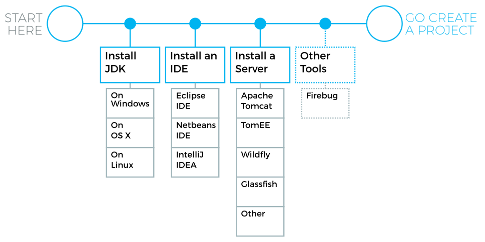

[[installing.overview]]
= Overview

You can develop Vaadin applications in essentially any development environment
that has the Java SDK and deploys to a Java Servlet container.
You can use Vaadin with any Java IDE or no IDE at all.
Vaadin has special support for the Eclipse and NetBeans IDEs, as well as for IntelliJ IDEA.

.Vaadin installation steps

Managing Vaadin and other Java libraries can get tedious to do manually, so using a build system that manages dependencies automatically is adviced.
Vaadin is distributed in the Maven central repository, and can be used with any build or dependency management system that can access Maven repositories, such as Ivy or Gradle, in addition to Maven.

Vaadin has a multitude of installation options for different IDEs and dependency
managers.
You can also install it from an installation package:

* With the Eclipse IDE, use the Vaadin Plugin for Eclipse, as described in <<installing.eclipse,"Vaadin Plugin for Eclipse">>
* With the Vaadin plugin for NetBeans IDE ( <<dummy/../../../framework/getting-started/getting-started-netbeans#getting-started.netbeans,"Creating a Project with NetBeans IDE">>) or IntelliJ IDEA
* With Maven, Ivy, Gradle, or other Maven-compatible dependency manager, under Eclipse, NetBeans, IDEA, or using command-line, as described in <<dummy/../../../framework/getting-started/getting-started-maven#getting-started.maven,"Using Vaadin with Maven">>
* From installation package without dependency management, as described in <<dummy/../../../framework/getting-started/getting-started-package#getting-started.package,"Vaadin Installation Package">>
