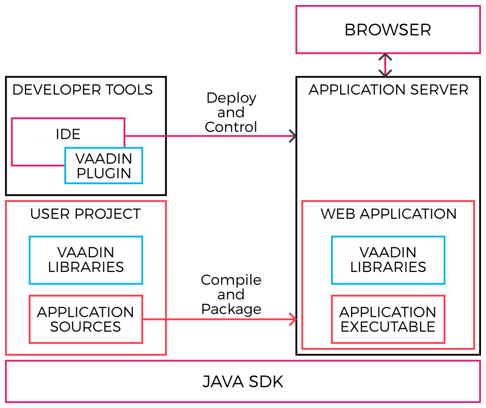

[[getting-started.environment]]
= A Reference Toolchain

This section presents a reference development environment.
Vaadin supports a wide variety of tools, so you can use any IDE for writing the code, almost any Java web server for deploying the application, most web browsers for using it, and any operating system platform supported by Java.

In this example, we use the following toolchain:

* Windows, Linux, or Mac OS X
* link:http://www.oracle.com/technetwork/java/javase/downloads/index.html[Oracle Java SE 8] (Java 6 or newer is required)
* link:http://www.eclipse.org/downloads/[Eclipse IDE for Java EE Developers]
* link:http://tomcat.apache.org/[Apache Tomcat 8.0 (Core)]
* link:http://www.getfirefox.com/[Mozilla Firefox] browser
* link:http://www.getfirebug.com/[Firebug] debug tool (optional)
* link:http://vaadin.com/download/[Vaadin Framework]

The above reference toolchain is a good choice of tools, but you can use almost
any tools you are comfortable with.

We recommend using Java 8 for Vaadin development, but you need to make sure that
your entire toolchain supports it.

[[figure.toolchain]]
.Development Toolchain and Process

<<figure.toolchain>> illustrates the development toolchain. You develop your
application as an Eclipse project. The project must include, in addition to your
source code, the Vaadin libraries. It can also include project-specific themes.

You need to compile and deploy a project to a web container before you can use
it. You can deploy a project through the Web Tools Platform (WTP) for Eclipse
(included in the Eclipse EE package), which allows automatic deployment of web
applications from Eclipse. You can also deploy a project manually, by creating a
web application archive (WAR) and deploying it to the web container.
