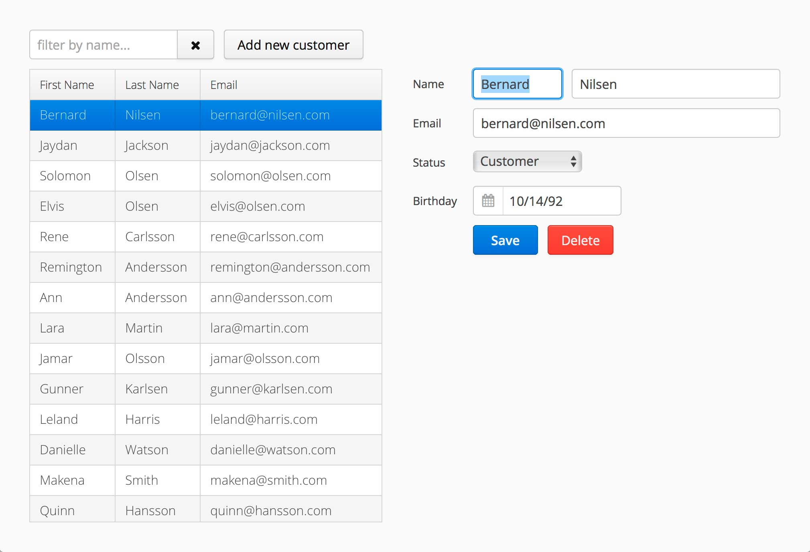
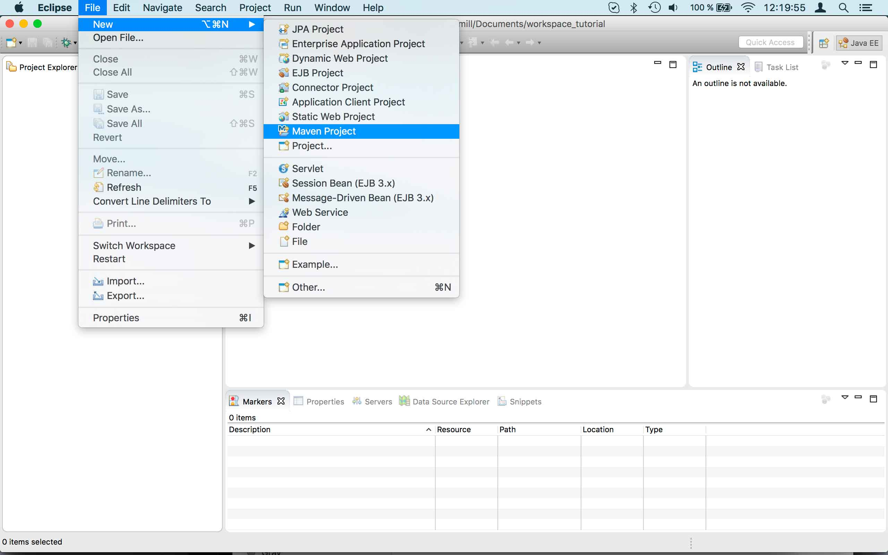
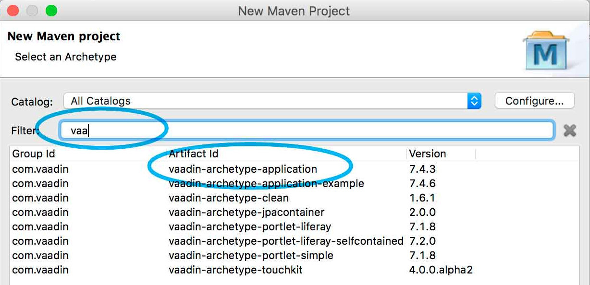
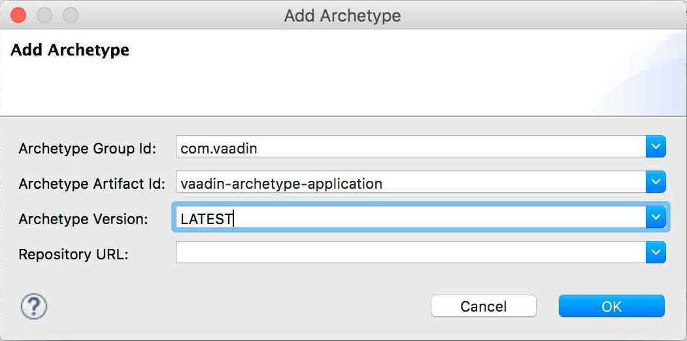
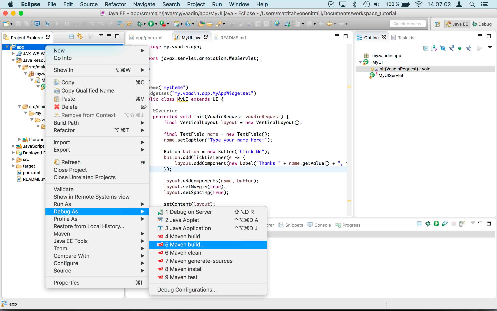
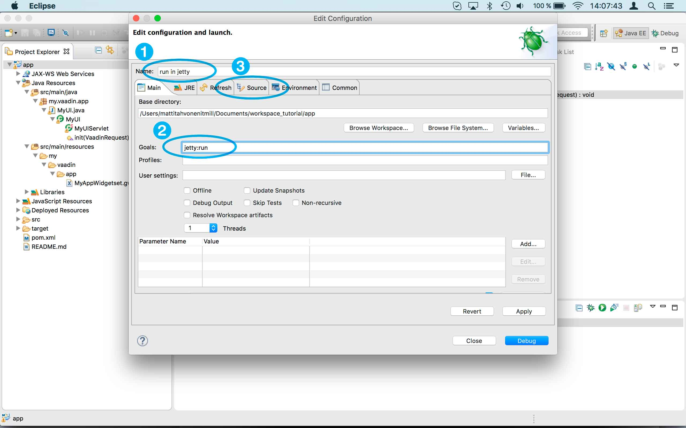
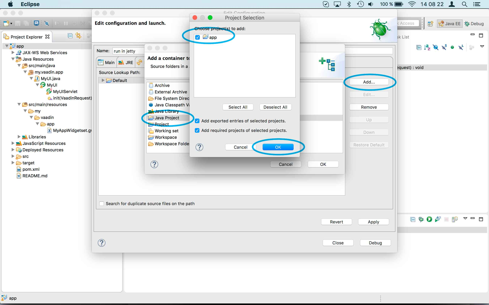
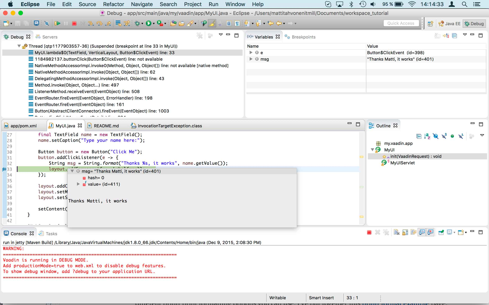
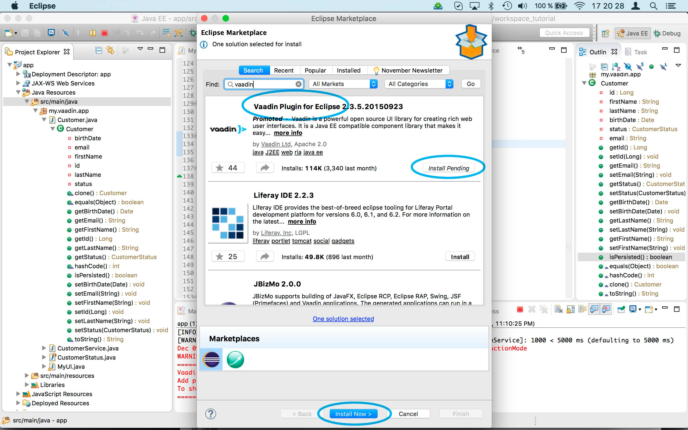

:sectnums:

[[framework.tutorial]]
= Vaadin Tutorial

This tutorial gives you an overview of how you can use https://vaadin.com/framework[Vaadin Framework] to build single-page web UIs for your Java application.
All you need to start with it is JDK 8 and an https://en.wikipedia.org/wiki/Integrated_development_environment[IDE], such as Eclipse.
While this tutorial is written for Eclipse users, you can use your IDE of choice.
No extensive knowledge of Java is needed, only basic programming skills are required.

[[framework.tutorial.overview]]
== Overview

In this tutorial, we build a simple customer management system.
It is not a real application; we use an in-memory "back-end", so that you can understand how to hook it to an existing Java based back-end.
We cover the basic Vaadin development and you can use the result as a basis for more experiments with Vaadin, such as using add-ons, your own custom look-and- feel (aka. theme), adding new views, or optimizing the result for mobile support.

[[figure.framework.tutorial.final-ui]]
.UI to be built in the tutorial

You need about 20 to 60 minutes to complete the tutorial, depending on your existing experience.
Naturally, you can just do the beginning of the exercise or pick any of the steps you want.
To start from a specific step, we have prepared the example code after each step to be downloaded as a zip file.
If do not want to do the exercise at all, you can also just https://github.com/vaadin/tutorial/[download the final application] and play around with it.

[[framework.tutorial.overview.tools]]
=== Installing the Development Tools

The tutorial uses Java 8, so please ensure that you have an up-to-date JDK 8 installed.
Most Linux distributions can use package managers to install JDK8.
Windows and Mac users should download it from http://www.oracle.com/technetwork/java/javase/downloads/index.html[Oracle's Java
SE site].

Also make sure you have the latest version of your IDE.
Eclipse is available in various packages; be sure to download the *Eclipse IDE for Java EE Developers* from http://www.eclipse.org/downloads/[eclipse.org].

Please refer to <<getting-started/getting-started-environment#getting-started.environment, "Setting up the Development Environment">> for information regarding installing the tools.

[[framework.tutorial.archetype]]
== Creating a Project from an Archetype

As the starting point for the application, we use a Maven archetype called `vaadin-archetype-application`.
Archetypes are project stubs that have some example code and a basic Maven build script.

. Start by choosing "File > New > Maven Project" from the menu.
+
[[figure.framework.tutorial.create-maven-project]]
.Create a new Maven project

+
TIP: If the [guilabel]#Maven Project# is not visible in the menu, you should switch to the _Java EE_ perspective.
You can use the shortcut button in the tool bar or "Window > Perspective" to switch to the perspective.

. The first step in the wizard is good as is for our purpose.
Just click [guibutton]#Next#.

. In the second step, you need to choose the `vaadin-archetype-application` archetype.
+
.Selecting the archetype

+
You can first try to find it using the filtering function.
+
If Eclipse has not yet indexed the archetype catalog, you need to manually add the archetype details.
// +
// .Adding a new archetype
// image::img/projectWizard2-add.jpg[width=70%]
+
Click the [guibutton]#Add Archetype# button.
+
.Settings for a new archetype

+
Enter the following values:
+
[guilabel]#Group ID#::
 Give `com.vaadin`
[guilabel]#Artifact ID#::
 Give `vaadin-archetype-application`
[guilabel]#Version#::
 You can find the latest Vaadin version number from http://vaadin.com/download/[vaadin.com/download].
[guilabel]#Repository URL#::
 This can be left blank.

+
And click [guibutton]#OK#.
Now you can select the new archetype from the list.

+
WARNING: Eclipse has a bug in its project wizard.
The `vaadin-archetype-application` may not appear in the listing, even though you added it using the [guibutton]#Add Archetype# button.
If this occurs, close the whole new project wizard and re-open it by selecting "File > New > Maven Project" again.
The archetype then typically appears in the listing and can be found by the filtering functionality.

. In the next wizard step, type in the following fields:
[guilabel]#Group Id#:: `my.vaadin`
[guilabel]#Artifact Id#:: `app`

+
and click [guibutton]#Finish#.

If this is your first Vaadin app, creating a project might take a while, depending on the speed of your network, as Vaadin libraries and other dependencies are being downloaded.
Maven caches them on your local file system.
Creating your next Maven-based Vaadin project will be much faster.

Right click on the newly created project and choose "Run as > Maven Install".
This initiates a full build of your application and finally creates a https://en.wikipedia.org/wiki/WAR_(file_format)[WAR] file into the [filename]#target# directory.
You can deploy the WAR file to your application server.
The first build will take a while, as Maven might again need to download some new modules.
Also, the project uses add-ons and contains a project specific theme.
Compiling them takes a while.

TIP: For the Maven compilation to work you need a JDK to be configured in your
Eclipse in "Window > Preferences > Java > Installed JREs > Add...".
This step is necessary at least on Windows, if you are using a fresh installation of Eclipse or for some other reason haven't configured a JDK to your Eclipse.
The JDK by default installs to [filename]#\Program Files\Java# on Windows.
You can make JDK the default JRE for your Eclipse.

While the build is running, let us have a look at what the archetype created for
you.
You can browse your project resources from the tree structure in the [guilabel]#Project Explorer#.
Maven's [filename]#pom.xml# on top level contains settings for building your project and declares the used dependencies.
Open [guilabel]#Java Resources# and below it [filename]#src/main/java#, the main source directory, and [packagename]#my.vaadin.app#, the main Java package that will contain your Vaadin UI code.

TIP: Eclipse shows all project files in the Project Explorer.
In this case, you can also find your [filename]#.java# files from under the top-level [filename]#src# node.
However, the suggested method is to access them from under the [guilabel]#Java Resources# node, which is optimized for editing Java source code.

The UI code (and the Servlet declaration) used by the application stub can be
found in the [filename]#MyUI.java# file.
Let us read it through to see how it works.
The [methodname]#init()# method of a UI class is triggered when a user enters your web application.
The [classname]#VerticalLayout# is one of the most used layout components, which
are used to position and display other Vaadin components in your UI classes.
The example code creates one [classname]#TextField# to allow the user to input her name and a [classname]#Button# whose click listener dynamically adds a new [classname]#Label# component to the main layout.
In the end of the [methodname]#init()# method, we just configure the main layout and place components into it and set it to be the content of [classname]#MyUI#.

To test your first Vaadin application, right-click on the project and choose "Debug as > Maven build...".
The debug mode is slightly slower than the basic run mode, but it often helps you to figure out what is happening in your application.

[[figure.framework.tutorial.debug-as-maven-build]]
.Starting the server using a Maven target

In the dialog, type `Run in jetty` to the [guilabel]#Name# input and `jetty:run` to the [guilabel]#Goals# input.

[[figure.framework.tutorial.jetty-run]]
.Generating a Maven launch for `jetty:run` target

Before clicking debug, to make sure debugging works properly, add your Java
project to the source lookup path from the [guilabel]#Source# tab, as it is being done in <<figure.tutorial.creating.add-sources>>.

[[figure.tutorial.creating.add-sources]]
.Adding sources for debugging

Now click [guibutton]#Debug# to continue.
This will download a small Java web server (if not cached to your local Maven repository), and use it to host your application.
Once the server has started, point your browser to the URL http://localhost:8080/[http://localhost:8080/] to see the running application.

If you make changes to the code, the Jetty server will notice the changes and in
a couple of seconds most changes are automatically deployed.
Reloading the page in your browser will show the changes.

TIP: In some cases your JVM might not allow injecting changes on the fly.
In these cases, Eclipse will complain about "Hot code replacement error".
Just choose to restart the server to get the latest changes.
Many Java developers use a commercial tool called http://zeroturnaround.com/software/jrebel/[JRebel] to make code replacement work better.

Mastering the usage of the Java debugger is also handy to better understand how your application actually works and fixing bugs that all developers write at some point.
As Vaadin is "only" Java code, you can use all of Java's debugging tools, which cannot be done with other UI frameworks where the UI is written (partly) in HTML and/or JavaScript.
Double-click on the line number in the Java editor, for example of the following line in the click listener:

[source,java]
----
layout.addComponent(new Label("Thanks " + name.getValue()));
----

Doing so adds a breakpoint to the selected line.
If you then click the button in your browser, the execution of the application will stop on that line.
Eclipse will ask you to enter to _Debugging perspective_.
That way you can step through the execution and inspect the variables.
Clicking on the _play_ icon in the toolbar will continue the execution.
Double-click the same line again to remove the breakpoint.

[[figure.framework.tutorial.breakpoint]]
.Execution in a break point in the button click listener

Clicking the red square in the [guilabel]#Console# view will terminate the server process.
You can restart it easily form the run/debug history.
You can find that from the small down arrow next to the green play button or bug button (for the debug mode) in the tool bar.
Alternatively, you can use the main menu "Run > Run
history/Debug history > Run in Jetty".

To get back to the _Java EE Perspective_, an Eclipse mode designed for editing Java web app code, click the [guibutton]#Java EE# button in the toolbar.

[[framework.tutorial.backend]]
== Adding a demo "backend"

Before getting more into real Vaadin development, let us introduce some domain objects and a "fake backend".
In a real-world application, you will most likely have something similar, implemented with, for example, JPA and EJB or a Spring-based service.

Copy the following three classes from github to your project.
Class names point to the classes hosted in Github.
Copying classes can be done in many ways.

TIP: The fastest way to copy classes using Eclipse is to use your good old
clipboard. Select the text content of the whole class from your browser, choose
"Edit > Copy", focus the node representing the [packagename]#my.vaadin.app# Java package in Eclipse's Java Resources view and choose "Edit > Paste".
Eclipse is smart enough to automatically create a properly named Java file for the class.

 * https://raw.githubusercontent.com/vaadin/tutorial/master/src/main/java/my/vaadin/app/CustomerStatus.java[CustomerStatus] - this is a simple enum class
 * https://raw.githubusercontent.com/vaadin/tutorial/master/src/main/java/my/vaadin/app/Customer.java[Customer] - this is the main domain object, a basic Java bean that we will be using in our example
 * https://raw.githubusercontent.com/vaadin/tutorial/master/src/main/java/my/vaadin/app/CustomerService.java[CustomerService] - this is a simple facade via which you can request and modify [classname]#Customer# instances.
 You can think of this as your entry point to your fake database.

In the next steps, we will be using these classes and build a UI around them.
The actual implementation of these classes is not relevant for this tutorial, but feel free to have a look around.

[[framework.tutorial.grid]]
== Listing entities in a Grid

TIP: Starting from this step directly? https://github.com/vaadin/tutorial/archive/step2.zip[Download the project] for this step, extract the zip file and choose "Import... > Maven > Existing Maven project".

Often when you start building a UI for a data-centric application, the first
thing you want to do is to list your data from your back-end.
There are several components and ways in Vaadin to do this.
In this example, we will use the Grid component for tabular presentation of our customers.

We start by introducing a [classname]#Grid# to the [classname]#MyUI# class.
We could of course just introduce the Grid as a variable in the [methodname]#init()# method, but we most likely want to refer to it later.
Also, let us get a reference to the [classname]#CustomerService#.

[source,java]
----
public class MyUI extends UI {
    // Add the next two lines:
    private CustomerService service = CustomerService.getInstance();
    private Grid grid = new Grid();

    // The rest is already there...
    @Override
    protected void init(VaadinRequest vaadinRequest) {
        ...
----

TIP: If you are new to Java development, you probably do not feel comfortable
with the red compilation error for the line where the [classname]#Grid# got introduced, because of a missing import.
This is easily fixed in Eclipse by using the
menu:Source[Organize Imports] command. Learn its shortcut (kbd:[Ctrl-Shift-O] or
kbd:[CMD-Shift-O] on Macs), you'll be using it a lot in Java development. In
possible class name collisions, always choose the appropriate class from the
_com.vaadin.ui_ package if you want to import core Vaadin UI classes like the
Grid.

To simply list all properties of all Customer objects from the backend service,
replace the init method with the following snippet:

[source,java]
----
@Override
protected void init(VaadinRequest vaadinRequest) {
    final VerticalLayout layout = new VerticalLayout();

    // add Grid to the layout
    layout.addComponents(grid);

    // fetch list of Customers from service and assign it to Grid
    List<Customer> customers = service.findAll();
    grid.setContainerDataSource(new BeanItemContainer<>(Customer.class, customers));

    layout.setMargin(true);
    setContent(layout);
}
----

TIP: Again, use the organize imports feature. The List object we use here is
_java.util.List_.

As we'll want to refresh the listing from various places in our application,
extract the customer listing part into its own "updateList" method with the
*public* modifier. The public modifier is handy later when we want to update the
listing from other classes. You can let Eclipse help here by selecting the
relevant lines and using the "quick fix" feature (kbd:[Ctrl+1] or kbd:[Cmd+1] on
Macs). The extracted method call looks like this:

[source,java]
----
    public void updateList() {
        List<Customer> customers = service.findAll();
        grid.setContainerDataSource(new BeanItemContainer<>(Customer.class, customers));
    }
----

If you try the application now, you'll see that quite many properties of the
customers are shown in the grid. To limit the visible properties, configure
the Grid using the _setColumns_ method to only show "firstName", "lastName" and
"email" properties.

[source,java]
----
    grid.setColumns("firstName", "lastName", "email");
----

At this point the body of the MyUI class should look like this (servlet declaration
omitted):

[source,java]
----
private CustomerService service = CustomerService.getInstance();
private Grid grid = new Grid();

@Override
protected void init(VaadinRequest vaadinRequest) {
    final VerticalLayout layout = new VerticalLayout();

    grid.setColumns("firstName", "lastName", "email");
    // add Grid to the layout
    layout.addComponent(grid);

    updateList();

    layout.setMargin(true);
    setContent(layout);
}

public void updateList() {
    // fetch list of Customers from service and assign it to Grid
    List<Customer> customers = service.findAll();
    grid.setContainerDataSource(new BeanItemContainer<>(Customer.class, customers));
}
----

You can now save your changes to the file and verify the changes from your browser.
You can do this at any point during the rest of the tutorial as well.

[[framework.tutorial.filtering]]
== Creating live filtering for entities

TIP: Starting from this step directly? https://github.com/vaadin/tutorial/archive/step3.zip[Download the project] for this step, extract the zip file and choose menu:Import...[Maven>Existing Maven project].

A search functionality is expected in every modern application and it is
also a nice Vaadin development exercise. Let's add a filtering functionality to
the Customer listing we created in the previous step.

We'll start by introducing a TextField component as a field to our UI class:

[source,java]
----
    private TextField filterText = new TextField();
----

In the _init_ method, configure the text field to contain a helpful input prompt
and add a text change listener to the field. The exact place of these lines is
not important, but add them, for example, after you have introduced the _layout_
object.

[source,java]
----
filterText.setInputPrompt("filter by name...");
filterText.addTextChangeListener(e -> {
    grid.setContainerDataSource(new BeanItemContainer<>(Customer.class,
            service.findAll(e.getText())));
});
----

TIP: To keep your code more readable, you can use autoformat after you write or
copy paste code snippets. The default keyboard shortcut in Eclipse is
kbd:[Ctrl+Shift+F] or kbd:[Cmd+Shift+F]

The text change listener is another listener (in addition to the more commonly
used ValueChangeListener) you can use with text fields in Vaadin. It is fired
lazily while the user is typing, but only when there is a small pause in the
typing. This makes it perfect for this kind of automatic filtering. When the
user has changed the text, we'll just update the listing like in the updateList
method, but use the current text as a filter for entries.

To keep the _updateList_ method functional, it should also take into
consideration the possible value in the filterText field. Change the line for
fetching the customers into this:

[source,java]
----
  List<Customer> customers = service.findAll(filterText.getValue());
----

Before adding the text field to the UI, let's improve the usability a bit
and make a short exercise to compose better components from lower level UI
components. The search field can naturally be cleared with the keyboard, but let's
add a clear button next to the text field. Start by adding the following lines
to the init method, for example right after your filterText configuration:

[source,java]
----
Button clearFilterTextBtn = new Button(FontAwesome.TIMES);
clearFilterTextBtn.setDescription("Clear the current filter");
clearFilterTextBtn.addClickListener(e -> {
  filterText.clear();
  updateList();
});
----

Vaadin contains a set of built in icons, from which we use the "X" icon,
_FontAwesome.TIMES_, here, which most users will recognise as a functionality to clear
the value. If we set the description to a component, it will be shown as a
tooltip for those users who hover the cursor over the button and wonder what to
do with it. In the click listener, we simply clear the text from the field and
refresh the content of the listing.

Vaadin contains lots of different kinds of layouts. The simplest way to align
the text field and the button next to each other would be to use a
HorizontalLayout. An alternative way we use here is using a CssLayout, which is
a lightweight layout that is easy to customize with css. Even if you wouldn't
want to play with CSS yourself, you can often use one of the existing style
rules in the default _Valo_ theme. The following snippet will create a nice
compact "composition" of both the TextField and the clear button. Add these
lines to the init method right after you configured the _clearFilterTextBtn_:

[source,java]
----
CssLayout filtering = new CssLayout();
filtering.addComponents(filterText, clearFilterTextBtn);
filtering.setStyleName(ValoTheme.LAYOUT_COMPONENT_GROUP);
----

Finally, *change* the row in the init method that currently adds only the grid,
to add both _filtering_ composition and the _grid_ to the main _layout_ of the
application.

[source,java]
----
    layout.addComponents(filtering, grid);
----

Now it is a good place to save your changes and try them in your browser.

[[framework.tutorial.form]]
== Creating a form to edit Customer objects

To edit and add Customer objects we need to create a form, that edits the
values in our domain objects. This tutorial has two alternative methods to do
that. Pick either of them.

[[framework.tutorial.form.designer]]
=== Creating a form using Vaadin Designer

TIP: Starting from this step directly? https://github.com/vaadin/tutorial/archive/step4.zip[Download the project] for this step, extract the zip file and choose menu:Import...[Maven>Existing Maven project].

The form to edit Customer objects can be built using several methods of which
the visual composition by drag 'n' drop is the most intuitive. Vaadin
Designer is an Eclipse plugin that you can install and do WYSIWYG editing of
your view code. We'll use it to create the form and then hook the editing logic
to it with Java.

TIP: If you are using another IDE or just prefer to compose your user interface
with code, take the alternative step, <<Creating a form using plain Java>>,
where the CustomerForm is composed using plain Java code.

[[framework.tutorial.form.designer.install]]
==== Installing Vaadin Designer

Vaadin Designer comes as an integrated part of Vaadin Plugin for Eclipse. It can
be installed easily via Eclipse Marketplace. Choose menu:Help[Eclipse Marketplace]

In the dialog, just search for Vaadin and click _install_ to mark it for
installation. Clicking _Install Now_ will take you to choose the modules you want
and accept the license agreement.

[[figure.framework.tutorial.plugin-install]]
.Selecting Vaadin Plugin for Eclipse for installation in Eclipse Marketplace

If you get a security warning about the software containing unsigned content,
just accept the warning by clicking OK. After installation, Eclipse asks if you
want to restart. Click Yes.

TIP: When you use Vaadin Designer for the first time in the next
step, it will ask for a license key. Get a key from
https://vaadin.com/designer. If you are not willing to buy a license now, just
acquire a trial license.

[[framework.tutorial.form.designer.create]]
==== Creating the form design

The following screencast will show you how to produce the
_CustomerFormDesign.html_, a design file we need in this tutorial. Use pause and
slow motion to follow better what is being done in the video. Feel free to get creative!

video::B5dN69NSS78[youtube, width="640", height="400"]

TIP: At any point of the process, you can also switch to the markup mode where
you can edit the raw content of the .html file. If you wish to take a shortcut
or think you did something wrong when using the designer, you can just
copy-paste the content of https://github.com/vaadin/tutorial/blob/master/src/main/resources/my/vaadin/app/CustomerFormDesign.html[the final state] to your own .html file.

At this point we only have a static mockup of the actual UI. To implement a
functional form component, we need some Java code as well. Vaadin Designer
automatically creates a similarly named Java class, but a good habit is to never touch the auto-generated file, in this case the
CustomerFormDesign.java file. If you'd introduce a new field to your form,
your changes to CustomerFormDesign would be overridden by the tooling. Instead,
we'll create a class called CustomerForm which inherits from the auto-generated
CustomerFormDesign class.

Start by creating a new Java class with the name CustomerForm. In Eclipse, right
click on the "my.vaadin.app" package and choose menu:New[Class]. Type in the
name _CustomerForm_, define the superclass as
_my.vaadin.app.CustomerFormDesign_ and click _finish_.

From the superclass, we inherit all the UI elements that we named when using
the designer. E.g. by simply referencing to "save" field in the CustomerForm,
we'll have access to the save button we previously created.

We will later need a reference to the currently edited Customer object,
CustomerService and the MyUI that uses this class. Add these fields and a
basic constructor that accepts MyUI as a parameter to the CustomerForm class:

[source,java]
----
CustomerService service = CustomerService.getInstance();
private Customer customer;
private MyUI myUI;

public CustomerForm(MyUI myUI) {
    this.myUI = myUI;
}
----

Although the form is not yet fully functional, you might want to see what it
looks like at this point. Add it as a field to the _MyUI_ class:

[source,java]
----
    CustomerForm form = new CustomerForm(this);
----

Now let's modify the init method in MyUI to show the form. Let's wrap both the
Grid and the CustomerForm in a horizontal layout and configure the Grid to use
all of the available space more efficiently. Replace the line
*layout.addComponents(filtering, grid);* with the following:

[source,java]
----
HorizontalLayout main = new HorizontalLayout(grid, form);
main.setSpacing(true);
main.setSizeFull();
grid.setSizeFull();
main.setExpandRatio(grid, 1);

layout.addComponents(filtering, main);
----

If you now save your changes and reload your application page in a browser,
you should see your CustomerForm next to the grid that lists your
existing entities.

Let's get back to the CustomerForm. The first thing we'll need is to populate
the options for the select. To add all enum values as valid selections, add the
following line to the constructor:

[source,java]
----
    status.addItems(CustomerStatus.values());
----

Let's also improve the UX a bit. When building the design, we already
emphasized the save button with a ValoTheme.BUTTON_PRIMARY style name. Thus, it
would be natural if the enter-key would do the same action as clicking the
save button. Assign a keyboard shortcut to the save button with this line in the
constructor:

[source,java]
----
save.setClickShortcut(KeyCode.ENTER);
----

To finish our form, we need to create a public API that we will use in the next
part from MyUI, to pass in a Customer object that the form should edit. We
will also add some logic to actually save the changes. We'll start by creating a
setter method to the Customer field. Just type _setCus_ in the body of the
class and hit autocomplete (kbd:[Ctrl+Space]) and Eclipse will create a method
stub for you. Complete it with the following implementation:

[source,java]
----
public void setCustomer(Customer customer) {
    this.customer = customer;
    BeanFieldGroup.bindFieldsUnbuffered(customer, this);

    // Show delete button for only customers already in the database
    delete.setVisible(customer.isPersisted());
    setVisible(true);
    firstName.selectAll();
}
----

In addition to saving the reference of the currently edited Customer object, we are
calling the _BeanFieldGroup.bindFieldsUnbuffered_ method. It will initialize all
similarly named editor fields in this form with the values from their
counterpart in the given Customer object. Also, it will automatically update the
values in the domain objects as the corresponding field value changes in the
user interface.

TIP: If the naming convention based databinding doesn't fit your needs, you
can use
https://www.vaadin.com/api/com/vaadin/data/fieldgroup/PropertyId.html[PropertyId]
annotation on fields to explicitly declare the edited property.

We'll also want to ensure the form is visible and that focus goes to the
firstName field to improve user experience. As we will be using the form to
edit both new non-persisted objects and existing customers, we will also show
the delete button only for customers that are already persisted in the backend.

The last thing we need to do is to handle save and delete button clicks. Add
the following methods to the CustomerForm class:

[source,java]
----
private void delete() {
    service.delete(customer);
    myUI.updateList();
    setVisible(false);
}

private void save() {
    service.save(customer);
    myUI.updateList();
    setVisible(false);
}
----

Finally, we'll add listeners to the buttons to call these methods. Adding these
simple lambda expressions to the constructor will take care of that:

[source,java]
----
save.addClickListener(e->this.save());
delete.addClickListener(e->this.delete());
----

TIP: For a truly re-usable form component in a real life project, you'd want to
introduce an interface to replace the myUI field or, even better, use an event
system like https://vaadin.com/wiki/-/wiki/main/Events+and+contexts[CDI events]
to completely decouple the components. We'll leave that out of this tutorial for
simplicity.

[[framework.tutorial.form.java]]
=== Creating a form using plain Java

This is an alternative step to the <<Creating a form using Vaadin Designer>>,
where you'll build the form UI programmatically in plain Java. If you already
completed the step using Vaadin Designer, you can proceed to
<<Connecting the form to the application>>.

Start by creating a new Java class with the name CustomerForm. In Eclipse right
click on the "my.vaadin.app" package and choose menu:New[Class]. Type in the
name _CustomerForm_, define the superclass as _com.vaadin.ui.FormLayout_ and
click _finish_.

In the form, we'll need editor fields for each property in our Customer domain
class. There are different kinds of fields in Vaadin for editing different kinds
of properties. In this example, we'll use a TextField, a PopupDateField and a
NativeSelect. Add the following field declarations and action buttons as Java
fields to the CustomerForm:

[source,java]
----
private TextField firstName = new TextField("First name");
private TextField lastName = new TextField("Last name");
private TextField email = new TextField("Email");
private NativeSelect status = new NativeSelect("Status");
private PopupDateField birthdate = new PopupDateField("Birthday");
private Button save = new Button("Save");
private Button delete = new Button("Delete");
----

Also, we will laterneed a reference to the currently edited Customer object,
CustomerService and the MyUI that uses this class. Add these fields and a
basic constructor that accepts MyUI as a parameter to the CustomerForm class:

[source,java]
----
private CustomerService service = CustomerService.getInstance();
private Customer customer;
private MyUI myUI;

public CustomerForm(MyUI myUI) {
    this.myUI = myUI;

    setSizeUndefined();
    HorizontalLayout buttons = new HorizontalLayout(save, delete);
    buttons.setSpacing(true);
    addComponents(firstName, lastName, email, status, birthdate, buttons);
}
----

In the constructor we make the form size undefined, which practically means it
will consume the minimum space defined by its content. Then we'll just add all
the fields to the CustomerForm and add action buttons to the bottom - side-by-side
using a HorizontalLayout. Although the form is not yet fully functional, you
might want to see what it looks like at this point. Add it as a field to the MyUI
class:

[source,java]
----
    CustomerForm form = new CustomerForm(this);
----

Now let's modify the init method in MyUI to show the form. Let's wrap both the
Grid and the CustomerForm in a horizontal layout and configure the Grid to use
all of the available space more efficiently. Replace the line
*layout.addComponents(filtering, grid);* with the following:

[source,java]
----
HorizontalLayout main = new HorizontalLayout(grid, form);
main.setSpacing(true);
main.setSizeFull();
grid.setSizeFull();
main.setExpandRatio(grid, 1);

layout.addComponents(filtering, main);
----

When you now save your changes and reload your application page in your browser,
you should see your CustomerForm next to the grid that lists your
existing entities.

Let's get back to the CustomerForm. The first thing we'll need is to populate
the options for the select. To add all enum values as valid selections, add the
following line to the constructor:

[source,java]
----
   status.addItems(CustomerStatus.values());
----

Let's also improve the UX a bit. The most common thing your users will want to
do with this kind of form is to save it. Let's decorate the button with a style
name that makes it more prominent in the UI and give it a keyboard shortcut -
simply an enter hit in this case:

[source,java]
----
save.setStyleName(ValoTheme.BUTTON_PRIMARY);
save.setClickShortcut(KeyCode.ENTER);
----

To finish our form, we need to create a public API that we will use in the next
part from the MyUI, to pass in a Customer object that the form should edit. We
will also add some logic to actually save the changes. We'll start by creating a
setter method for the Customer field. Just type _setCus_ in the body of the
class and hit autocomplete (kbd:[Ctrl+Space]) and Eclipse will create a method
stub for you. Complete it with the following implementation:

[source,java]
----
public void setCustomer(Customer customer) {
    this.customer = customer;
    BeanFieldGroup.bindFieldsUnbuffered(customer, this);

    // Show delete button for only customers already in the database
    delete.setVisible(customer.isPersisted());
    setVisible(true);
    firstName.selectAll();
}
----

In addition to saving the reference of the currently edited Customer object, we are
calling _BeanFieldGroup.bindFieldsUnbuffered_ method. It will initialise all
similarly named editor fields in this form with the values from their
counterpart in the given Customer object. Also, it will automatically update the
values in the domain objects as the corresponding field value changes in the
user interface.

TIP: If the naming convention based databinding doesn't fit your needs, you
can use
https://www.vaadin.com/api/com/vaadin/data/fieldgroup/PropertyId.html[PropertyId]
annotation on fields to explicitly declare the edited property.

We'll also want to ensure the form is visible and that the focus goes to the
firstName field to improve the user experience. As we will be using the form to
edit both new non-persisted objects and existing customers, we will also show
the delete button only for customers that are already persisted in the backend.

The last thing we need to do is to handle save and delete button clicks. Add
the following methods to the CustomerForm class:

[source,java]
----
private void delete() {
    service.delete(customer);
    myUI.updateList();
    setVisible(false);
}

private void save() {
    service.save(customer);
    myUI.updateList();
    setVisible(false);
}
----

Finally, we'll add listeners to the buttons to call these methods. Adding these
simple lambda expressions to the constructor will take care of that:

[source,java]
----
save.addClickListener(e->this.save());
delete.addClickListener(e->this.delete());
----

TIP: For a truly re-usable form component in a real life project, you'd want to
introduce an interface to replace the myUI field or, event better, use an event
system like https://vaadin.com/wiki/-/wiki/main/Events+and+contexts[CDI events]
to completely decouple the components. We'll leave that out of this tutorial for
simplicity.

[[framework.tutorial.form-connection]]
== Connecting the form to the application

TIP: Starting from this step directly? https://github.com/vaadin/tutorial/archive/step5.zip[Download the project] for this step, extract the zip file and choose menu:Import...[Maven>Existing Maven project].

In this part, we'll use the CustomerForm class, which we created in the
previous step, from the MyUI class. We will use it for both editing the existing
customers and creating new ones.

In the previous part, we already added the form to the _MyUI_ to see what it looks
like. By default, we want it to be invisible, so let's first hide it
by adding this line to the _init_ method of MyUI class:

[source,java]
----
form.setVisible(false);
----

To edit the customer chosen from the Grid, add the following selection listener to
the end of the _init_ method:

[source,java]
----
grid.addSelectionListener(event -> {
    if (event.getSelected().isEmpty()) {
        form.setVisible(false);
    } else {
        Customer customer = (Customer) event.getSelected().iterator().next();
        form.setCustomer(customer);
    }
});
----

In the listener, we simply take the Customer object of the selected row and pass it to
the CustomerForm for editing. In the previous step, we added a side effect to the
_setCustomer_ method that will bind the domain object to the corresponding fields
and make it visible. If the selection is empty, we'll hide the form.

To allow users to also create new customer records, we'll create a simple "Add
customer button" to the top of the UI, right next to the _filtering_ composition
we have already built from a CssLayout, a TextField and a Button. Introduce the new
Button with a click listener, by adding the following lines to the _init_ method,
right after where you introduced the _filtering_ composition:

[source,java]
----
Button addCustomerBtn = new Button("Add new customer");
addCustomerBtn.addClickListener(e -> {
    grid.select(null);
    form.setCustomer(new Customer());
});
----

In the click listener, we first clear a possible selection from the grid and then
instantiate a new Customer object and pass that to the form for editing.

To add it beside our _filtering_ composition, we can use a HorizontalLayout to
create a toolbar where we place both components. First, introduce a toolbar like
this after the previously created _addCustomerBtn_:

[source,java]
----
HorizontalLayout toolbar = new HorizontalLayout(filtering, addCustomerBtn);
toolbar.setSpacing(true);
----

And, again, *replace* the line that populates your main layout to add the
toolbar instead of just the filtering composition, which we just moved to the
_toolbar_ layout.

[source,java]
----
layout.addComponents(toolbar, main);
----

All planned features are now done. You can save the changes and play around with
the application. If something went wrong, you can also download an example of
https://github.com/vaadin/tutorial[the final application] and see what went wrong.

[[framework.tutorial.next]]
== It works! What next?

Congratulations! Users can now create, read, update and delete customer records
stored in the demo backend and you have completed creating your first CRUD UI
with Vaadin.

If you are an experienced Java developer, you are probably already full of ideas of
how you can use your existing skills and create new shiny web UIs for your
existing Java apps. If you want more ideas of how to create full stack
applications, you might, for example, go through the
http://spring.io/guides/gs/crud-with-vaadin/[Creating CRUD UI with Vaadin] guide
and create a bit similar UI with a real database backend implemented with Spring
Data JPA. We have also collected a couple of other resources for an easy
start in your Vaadin developer career.

 * https://vaadin.com/docs/-/part/framework/introduction/intro-overview.html[Vaadin online documentation]
 * http://spring.io/guides/gs/crud-with-vaadin/[Creating CRUD UI with Vaadin] - the tutorial for your first Vaadin application using a Spring based backend.
 * https://github.com/mstahv/jpa-invoicer[Jave EE example app] - a Vaadin app example for creating invoices that uses Java EE backend, Apache DeltaSpike Data for simple JPA layer, OAuth2 based login, PDF generation etc.
 * http://vaadin.com/directory[Directory] - a vast source of awesome Vaadin add-ons
